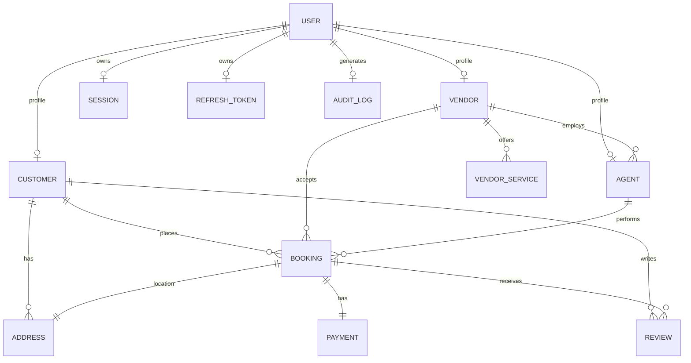

# 💾 Database Schema Design

The platform uses a PostgreSQL database managed via **Prisma ORM**. The data model consists of 14 core entities to ensure high consistency and enforce proper relations across user roles.

---

## 📊 Database Diagram (Mermaid)

---

## 🗃️ Database Tables Definition

1. **User**: Store credentials, names, emails, phones, general role tags, status, and verification ticks.
2. **Customer**: Linked 1:1 to User; tracks customer-specific details.
3. **Vendor**: Linked 1:1 to User; logs GSTIN, registration documents check, and rating.
4. **Agent**: Linked 1:1 to User; tracks current availability, rating, and linked vendor ID.
5. **Booking**: Stores booking numbers, links customer, vendor, and agent. Logs scheduled dates, slot, platform fee, and OTP verification code.
6. **Payment**: Links Booking ID, customer ID, transactional gateway hashes, and paid timestamps.
7. **Address**: Saved customer addresses with line labels (Home/Office/Other) and GPS coordinates.
8. **Service**: Core catalog services (Deep Cleaning, Plumbing, Gardening, etc.) with description and prices.
9. **VendorService**: Mapping table connecting vendors to custom rates and active services.
10. **Review**: Rating points (1-5) and feedback comments left by customers.
11. **Notification**: User-specific notification logs.
12. **Session**: Tracks active logins, token user agents, and IP locations.
13. **RefreshToken**: Implements JWT security key rotation.
14. **AuditLog**: High-security logging of admin and platform configuration edits.
